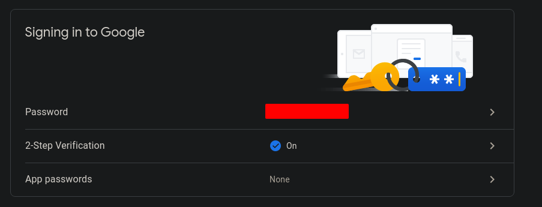
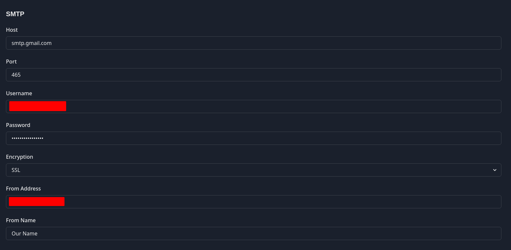

# Welcome

[MyFuture](https://github.com/0xc9c3/my-future/) is a small app to manage, track and send job applications.

Note: The stability and reliability of this application has not been thoroughly tested yet.
My personal goal with this app was to compare laravel to other Frameworks in general.


# Getting Started

Host the application somewhere as described in [Hosting](#Hosting) section.

Once the application is running you can create your first user using the [user:create](#create-a-user) 
command.

Login with your newly created user at /login.

## Applications

Here you are able to see all your sent applications. You can resend the application in case an 
email got lost or manually copy the link to your portfolio in case somebody asks you for it again.
The application history shows the occurred events, which can be

- sent when you are using this application for sending emails
- viewed in case you embedded the tracking pixel and the respondents' email client allows images
- clicked in case the someone clicked on the portfolio link

If you delete your application, stored events related to that application will also be lost.

## Templates

The "Templates" area is divided into two sections. One for portfolio templates and one for email
templates.

Note: All templates you wish to upload have to be wrapped as zip archives.

### Portfolio

A portfolio template is a basic webpage which could show your previous experiences and 
qualifications.

The index.html file is the base of your portfolio.

### Email

An email template can be used during the application process to enhance your application email
using frameworks like [mjml](https://mjml.io).

It also needs to contain an index.html and loading of assets is currently not supported.

## Respondents

A respondent is someone you sent an application. Each respondent can be either be activated
or deactivated. Once a respondent has been deactivated, he loses access to the web version
of your portfolio. This can be reverted by reactivating the respondent.

## Settings

### SMTP

In case you want to use the application to send your job application, you have to configure these
settings using your provider. 

#### Usage with gmail

To be able to use gmail we first need to create an app password.

This can be done by navigating to https://myaccount.google.com/ and create an app password.



Once we have created our app password we head over to the [Settings](#Settings) area.



Here we enter ```smtp.gmail.com``` as the smtp host, port 465 if we want to use ssl or 587 if
we want to use tls. Our username is the gmail address we are going to use, while the password is
our app password we generated in the previous step. 

Please make sure that your from address and your gmail address matches.

### Tracking

By default, all tracking options are disabled. This means, even though a respondent clicks on your
portfolio or opens an email with an included tracking pixel, no action will be logged.

## Account

Here you can edit your account email and password. You also have the option to enable TOTP 
authentication.

# Commands

## Create a user

```shell
user:create
```

Creates a new user with a specific email and generates a password.

Example:
```shell
artisan user:create test@test.org 
```

## Reset a users password

```shell
user:reset-password
```

Resets the password of a given user.

Example:
```shell
artisan user:reset-password test@test.org
```

## List all users

```shell
user:list
```

Lists all registered users.

Example:
```shell
artisan user:list
```

## Hosting

__Note: The production docker image has not yet been completed. The following part is for future
usage.__

The recommended way to host this application is via the supplied production docker container.

### Docker

The project root contains a docker-compose.prod.yml which can be used as a starting point.

It is highly recommended hosting this application in combination with a reverse proxy
like [Traefik](https://traefik.io/traefik/) or [nginx-proxy](https://github.com/nginx-proxy/nginx-proxy).

No prebuilt image has been released yet.

### Bare-metal

Requirements:
- Installation of a http server (Apache, Nginx,...)
- PostgreSQL 13
- PHP 8.0
- Composer 2.1.9
- NodeJS 16.12
- Chromium Dependencies

The easiest way to set up the application on bare metal, would be by following the steps of the
production docker container.

# Development

Development is done using docker and [laravel sail](https://laravel.com/docs/8.x/sail).

Note: The base laravel sail image uses the bundled php webserver which cannot be used
for the export function of this project as 

The app contains some basic tests inside tests/Browser which can be executed by running ```artisan dusk```.

Open/Planned ToDos:

- complete the production docker image
- make assets for email templates available via separate authenticated route
- option for the user to automatically replace the base url of used email templates.
- allow custom mail attachments
- smtp test button
- complete 2fa, email and portfolio tests
- use GitHub actions to deploy the documentation and update the production docker image
- use sendmail component inside resend modal, to be able to preview and edit the application before resending
- refactoring and quality
